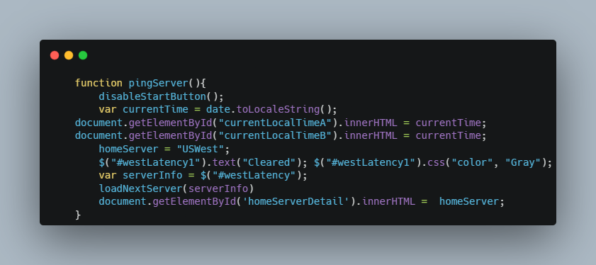

# `3on3ping Calculator`
This project was created for some brief practice with jQuery(CRAZY RIGHT?!), responsive design, and semantic html markup. 

From 2016-2021, 3on3FreeStyle did not have a means of measuring latency for a very ping reliant game, so I spun up this quick tool to help for practice and to the community out.

The website can be viewed at <a href="https://alienfunbug.github.io/3on3ping/">[https://alienfunbug.github.io/3on3ping/"](https://alienfunbug.github.io/3on3ping/)</a> or deprecated at <a href="https://alienfunbug.github.io/ketrio" style='text-decoration: none;'>3on3ping.com</a>.

### `Problem Statement`
At the time, a valid ping method didn't seem obvious; I considered ajax to ping server: but that was only boolean, timing a request to server: but that was inaccurate due to server process time, and ultimately this method I learned from Mike Leonhard (Score). Once the RTT 404 method was devised, the rest was making the data useful to potentially nontechnical crowd.

### `Method`  
Semi-accurate server ping or latency measurement within +/-10ms via recording round trip time to closest AWS dynamodb server and attempting to load an image that doesnt exist. Immediate 404 allows for minimum fluctuation in client/server processing time and accurate latency based on network path, hops, and other restrictions.

    
### `Reception`  
This tool was so well received and frequently used by the community, that JoyCity promptly implemented the feature that was missing for the first 6 years after launch. With this update, I was able to discontinue the service (Thanks here to ER Wolfe for hosting locally from his raspberry pi).